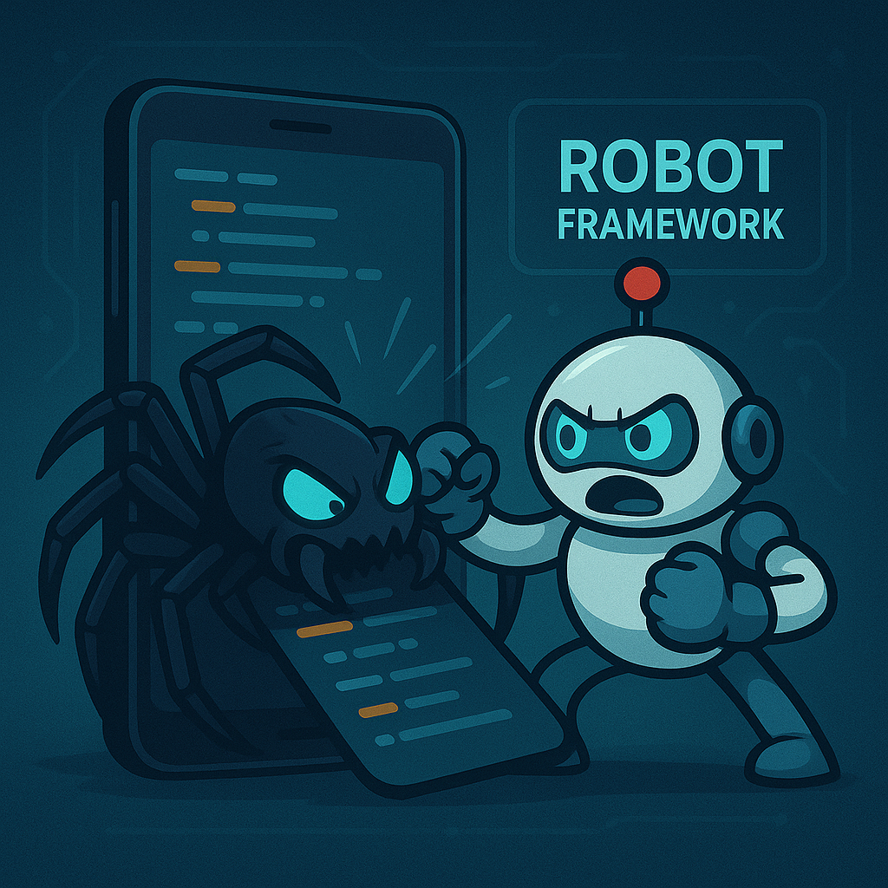

# Automação Mobile com Robot Framework - TED App

Este projeto é uma base para automação de testes do aplicativo móvel **TED** (aplicativo fictício), utilizando o **Robot Framework** com **Appium**. Ele segue boas práticas como o padrão Page Object, separação de locators em arquivos YAML e uso de keywords customizadas para criar testes robustos e reutilizáveis.

---
## 📁 Estrutura do Projeto

```
base_rf/
├── resource/
│   ├── app/                 # APK do app TED
|   |── images/              # Imagem do readme
│   ├── locators/            # Locators por tela em YAML
│   ├── pages/               # Page Objects (keywords por tela)
│   └── utils/               # Keywords utilitárias
|── results/                 # Logs e relatórios de execução
├──   └── log.html
├──   └── output.html
├──   └── report.html
├── test/
│   └── TED.robot            # Arquivo de testes principais
├── base.resource            # Recurso principal com imports
├── pyproject.toml           # Configuração do Poetry
├── poetry.lock              # Lock de dependências
├── .gitignore
|── README.md
```
---

## 🛠 Tecnologias Utilizadas

- **Robot Framework**: Framework de automação de testes.
- **AppiumLibrary**: Biblioteca para automação de apps móveis (Android/iOS).
- **Python**: Linguagem base para o projeto.
- **Poetry**: Gerenciador de pacotes Python.
- **PyYAML**: Manipulação de arquivos YAML (locators).

---

## ✅ Pré-requisitos

Antes de começar, instale os seguintes softwares:

- **Python 3.13+**: [Download](https://www.python.org/downloads/)
- **JDK (Java Development Kit)**: [Download](https://www.oracle.com/java/technologies/downloads/)
- **Node.js e npm**: [Download](https://nodejs.org/en/download/)
- **Android SDK (com ADB configurado)** – geralmente via Android Studio.
- **Appium Server**:
  ```bash
  npm install -g appium
  ```
- **Appium Doctor** *(opcional, recomendado)*:
  ```bash
  npm install -g appium-doctor
  appium-doctor
  ```

---

## ⚙️ Configuração do Projeto

1. **Clone o repositório**:
    ```bash
    git clone <URL_DO_SEU_REPOSITORIO>
    cd base_rf
    ```

2. **Instale o Poetry** (caso não tenha):
    ```bash
    pip install poetry
    ```

3. **Instale as dependências**:
    ```bash
    poetry install
    ```

4. **Inicie o Appium Server**:
    ```bash
    appium -pa wd/hub
    ```

5. **Configure um emulador Android ou conecte um dispositivo físico**:
    ```bash
    adb devices
    ```

---

## 🚀 Como Rodar os Testes

### ▶️ Executar Todos os testes

```bash
poetry run robot -d results/ -v EMULATOR:local test/TED.robot
```

### 🔖 Executar testes com tags

```bash
poetry run robot -d results/ -v EMULATOR:local -i c2 test/TED.robot
```

### 🍏 Rodar testes no iOS

*(Apenas referência. Nenhum `.ipa` incluso)*

```bash
poetry run robot -v PLATFORM_NAME:ios -d results/ -i c6 test/TED.robot
```

### ⚠️ Executar Todos os testes na Browserstack

```bash
poetry run robot -d results/ -v EMULATOR:local .
```

---

## 📊 Relatórios de Teste

Após a execução, os seguintes relatórios estarão disponíveis na pasta `results/`:

- `report.html`: Resumo geral dos testes.
- `log.html`: Detalhamento passo a passo.

---

## 🤝 Contribuição

Contribuições são bem-vindas!

- Sugira melhorias via *issues*.
- Faça um *fork*, crie uma *branch* e envie um *pull request*.
- Lembre-se de seguir o padrão do projeto e documentar suas mudanças.

---
